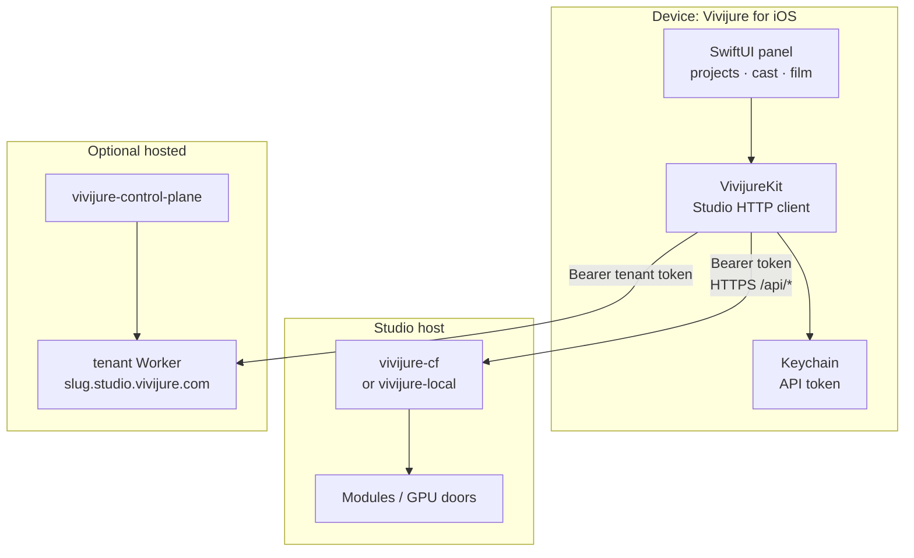

# vivijure-ios

**License:** AGPL-3.0-only  
**App name:** Vivijure for iOS (planned)  
**Status:** skeleton  
**Studio API:** [vivijure-cf](https://github.com/skyphusion-labs/vivijure-cf) / [vivijure-local](https://github.com/skyphusion-labs/vivijure-local)  
**Sibling:** [vivijure-android](https://github.com/skyphusion-labs/vivijure-android)  
**Agent door:** [vivijure-mcp](https://github.com/skyphusion-labs/vivijure-mcp)

## What this is

AGPL **native iOS client** for [Vivijure Studio](https://vivijure.com): the same film-studio surface
as the web panel, against a self-hosted or hosted studio Worker.

1. **`VivijureKit`** (Swift package) -- HTTP clients for the studio CONTRACT.
2. **App shell** (SwiftUI, scaffold) -- projects, cast, storyboard, render, artifacts.

Commercial value remains hosted convenience (control plane, ops, billing), not a closed app layer.
The full stack stays AGPL.

## How the pieces fit together



## Status

Skeleton only. Kit target + CI smoke test exist; panel UI and full CONTRACT coverage are not
implemented. See [docs/ARCHITECTURE.md](docs/ARCHITECTURE.md).

## Develop

```bash
swift test
```

## License

AGPL-3.0-only. See [LICENSE](LICENSE) and [NOTICE](NOTICE).
