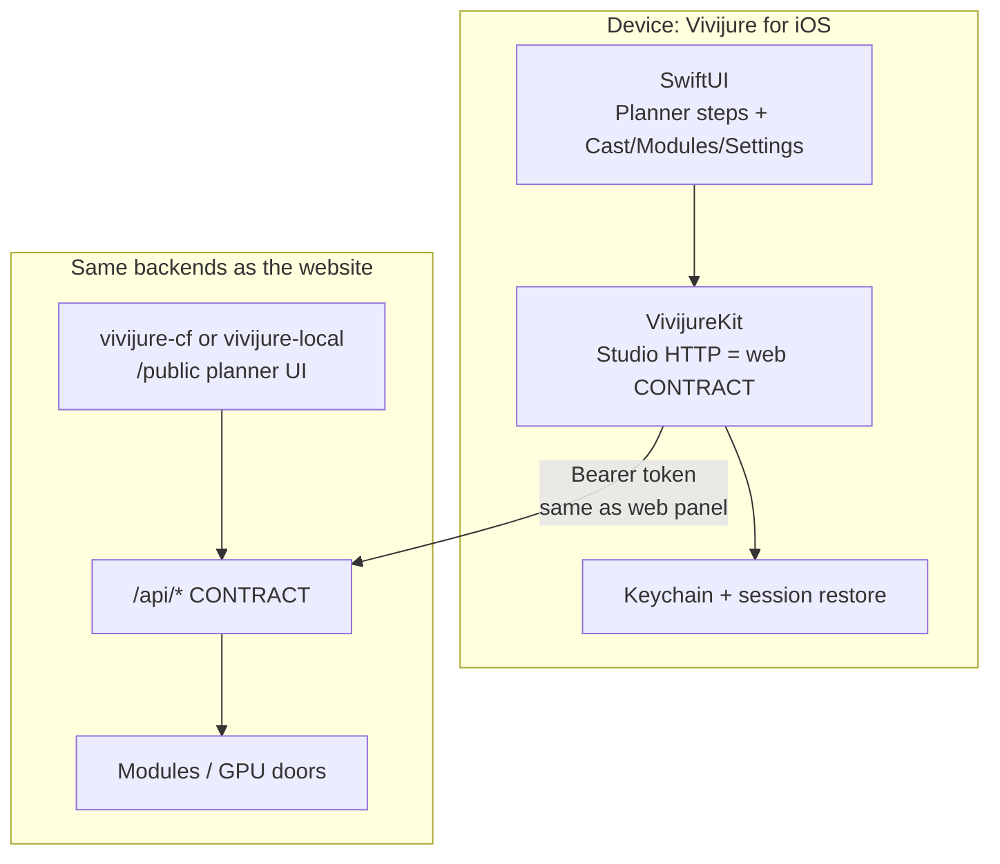

# vivijure-ios

**License:** AGPL-3.0-only  
**App name:** Vivijure for iOS (planned)  
**Status:** skeleton  
**Product role:** **mobile-friendly frontend to the Storyboard Planner**  
**Studio API:** [vivijure-cf](https://github.com/skyphusion-labs/vivijure-cf) / [vivijure-local](https://github.com/skyphusion-labs/vivijure-local)  
**Sibling:** [vivijure-android](https://github.com/skyphusion-labs/vivijure-android)  
**Agent door:** [vivijure-mcp](https://github.com/skyphusion-labs/vivijure-mcp)

## What this is

AGPL **native iOS client** for [Vivijure Studio](https://vivijure.com).

**Mandate:** everything possible on the **web planner** (and the studio pages beside it: Cast,
Modules, Settings) must be possible in this app against the same studio host and token. This is a
mobile-friendly frontend to the planner, not a cut-down companion.

1. **`VivijureKit`** (Swift package) -- HTTP clients for the studio CONTRACT.
2. **App shell** (SwiftUI) -- stepped planner UX + cast / modules / settings.

Commercial value remains hosted convenience (control plane, ops, billing), not a closed app layer.
The full stack stays AGPL.

## Parity scope

Web planner stages (from host `public/planner.html`):

| Step | Web | iOS target |
|------|-----|------------|
| Plan | brief, model, cast slots, plan/refine, scenes | full |
| Cast & Bundle | preflight, training images, bundle | full |
| Audio | score/narration, upload, BPM/snap, beat analyze | full |
| Render | quality, module config, keyframes-only, scatter, submit, poll | full |
| History | render library, tags, reopen, artifacts | full |

Plus studio nav: **Cast** library, **Modules**, **Settings**, account prefs.

Living checklist: **[docs/PARITY.md](docs/PARITY.md)**. Architecture notes:
[docs/ARCHITECTURE.md](docs/ARCHITECTURE.md).

## How the pieces fit together



## Status

Skeleton only. Kit target + CI smoke test exist; planner UX and CONTRACT coverage are not
implemented yet. Track gaps in `docs/PARITY.md`.

## Develop

```bash
swift test
```

## License

AGPL-3.0-only. See [LICENSE](LICENSE) and [NOTICE](NOTICE).
